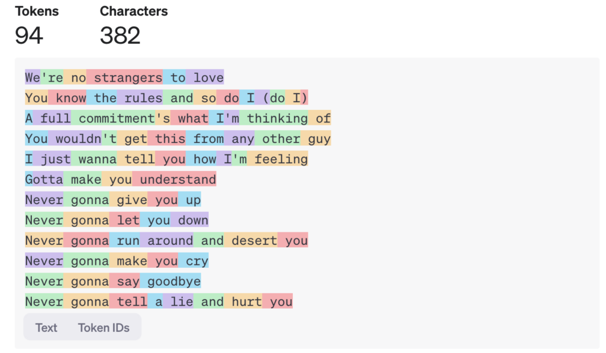

```{r setup, include=FALSE}
knitr::opts_chunk$set(echo = TRUE)
```

## Introduction

The goal of this lesson is to learn how to work with Large Language
Models (LLMs) in R using the `elmer` and `mall` packages.

The `ellmer` package allows us to communicate with LLM models without
leaving R Studio, and the `mall` package contains functions to perform
Natural Language Processing (NLP) operations, saving you time in having
to write code to perform multiple operations and having to glue
everything together into a table. What is also neat is that both
packages work well with the tidyverse.

The benefit of these packages is that they let us use LLMs directly in
code rather than through a browser, which makes it easy and fast to run
the same questions on multiple pieces of text. It beats copying and
pasting on a browser.


## Load Packages

```{r cars}

library(ellmer)
library(mall)
library(tidyverse)

```

## Load Amazon Book Review Data

We will use book reviews for Great Expectations by Charles Dickens
obtained from Amazon
([kaggle](https://www.kaggle.com/datasets/mohamedbakhet/amazon-books-reviews))
to see if a LLM can correctly assign the same user ratings (1-5) given a
user's review commentary.

{width="294"}

```{r}

great_expect_df <- read_csv("lesson_amazon_book_review_greatexpectations.csv")

head(great_expect_df)

```

## Tokens and API Requests

LLMs break down text into tokens. Tokens can be parts of words, whole
words, phrases, or even punctuation marks. The more text is feed or
created by an LLM, the more tokens there are created. LLM providers
charge users based on tokens, typically charged per thousand tokens
processed. They also limit a user in how many tokens or API requests can
be processed within a given time frame.

{width="586"}

## The \`Ellmer\` Package

The `elmer` package is designed to connect you to multiple LLM
providers, for example:

-   Anthropic (Claude): `chat_anthropic()`

-   OpenAI (ChatGPT): `chat_openai()`

-   Google (Gemini): `chat_google_gemini()`

Read the documentation here: <https://ellmer.tidyverse.org/index.html>

### Create Chat Object

First, you create a **chat** object that connects to you an LLM provider
in order to make API calls. This object contains the conversation (a
sequence of turns between user prompts and model responses). It starts
fresh, as if you are starting a new conversation in a browser, every
time a chat object is created.

The object can start with a **system prompt**, the set of instructions
that guide the model's behavior by giving the model a specific role or
setting constraints. It is not necessary but highly encouraged.

An LLM provider can have one or more **models**. In this case, we are
using **Google Gemini's 2.5 Flash**.

Follow these instrucitons to set up your Gemini key:
<https://ai.google.dev/gemini-api/docs/api-key>

```{r}

# system_prompt
prompt <- "You are an expert at analyzing book reviews. Your task is to read a review and assign it a sentiment rating."

# api key
api_key= # add your key here with "" (e.g. "abc1234")

# llm model
model = "gemini-2.5-flash"

# chat object
chat <- chat_google_gemini(system_prompt = prompt,
                           api_key  =  api_key,
                           model = model)

```

### Initiate Chat

You can chat in the terminal. We are going to run this a couple times to
see that the LLM does not give the same answer. LLMs are probabilistic.
The models "do not know" the answer; they simply predict. I like to
think of these models as very sophisticated, advanced, and quite fancy
linear regressions. I am very much down playing the math behind these
models but they are nothing more than a — computationally expensive —
formula.

```{r}
# terminal chat
chat$chat("
  Tell 5 facts about the book Great Expectations.
")

```

Or using a browser-style version that continues the same conversation.
As you can see our conversation is retained.

```{r}
# gui chat
live_browser(chat) 

```

## The `Mall` Package

The `mall` package treats NLP operations like any other data
transformation performed in the tidyverse. It comes with several preset
functions, along with the ability to create a custom operation:

-   Classification based on preset categories: `llm_classify()`

-   Text extraction: `llm_extract()`

-   Sentiment analysis (positive, negative, neutral) `llm_sentiment()`

-   Text summarization: `llm_summarize()`

-   Text translation: `llm_translate()`

-   Custom prompt: `llm_custom()`

Read the documentation here: <https://mlverse.github.io/mall/#summarize>

### Using `llm_sentiment()`

In this simple example, we will create a table and then apply the
`llm_sentiment()` function on a column.

```{r}

llm_use(chat)

simple_npl <- tibble(
  id = 1:5, 
  adjective = c('painful', 'hungry', 'cheerful', 'exciting', 'stoic')
)

simple_npl %>%  
  llm_sentiment(col = adjective)


```

### `Llm_custom` to generate new data from text

Now, let's use our own prompt to generate LLM book ratings from user
review comments.

```{r}

my_prompt <- paste(
  "Based on the sentiment and tone of the following book review,",
  "assign a numerical rating from 1 (very negative) to 5 (very positive).",
  "Return only the number (1, 2, 3, 4, or 5), no explanation.",
  "Review:"
)

```

For time purposes, let's see 10 responses. Let's compare user scores and
LLM-generated scores.

```{r}

great_expect_df_llm <- great_expect_df %>%
  slice_sample(n = 10) %>% 
  mutate(
    llm_review_score = mall::llm_vec_custom(review_text, my_prompt)
  ) %>% 
  mutate(llm_review_score = as.numeric(llm_review_score))

great_expect_df_llm %>%
  select(review_score, llm_review_score)

```

## Validating LLM Responses

### Hypothesis Testing

I ran this for the entire data set (800-ish comments/rows) ahead of
time; it took a few minutes to run.

Let's test if the LLM-assigned review scores are statistically different
than the real user scores.

```{r}
great_expect_df_llm <- read_csv("L:/Data Meetups/Meeting Documents/1-26 - R AI Packages/Input/test_amazon_book_review_greatexpectations.csv")
```

The average human score is 4.08 and the average LLM-assigned score is
4.10. The LLM is slightly higher. However, the p-value (0.59) is not
less than 0.05, so we fail to reject the null hypothesis that the user
score is the same as the LLM score. We find that the average scores are
not significantly different.

```{r}
mean(great_expect_df_llm$review_score)
mean(great_expect_df_llm$llm_review_score)

# Run a paired t-test to see if ratings differ
t_test <- t.test(
  great_expect_df_llm$review_score,
  great_expect_df_llm$llm_review_score,
  paired = TRUE
)

print(t_test)
```

### Rating Error

What is the distribution of differences across human scores and
LLM-assigned scores? We find that about 71% of the time the LLM model
predicts the same user score. The rest of the time – for the most part –
it is off by 1 point and a little over 4% of the time by 2 points or
more.

```{r}
# create error table
error_table <- great_expect_df_llm %>%
  mutate(
    abs_error = abs(review_score - llm_review_score)
  ) %>%
  count(abs_error) %>%
  arrange(abs_error) %>%
  mutate(
    percent = n / sum(n) * 100
  )

ggplot(error_table, aes(x = factor(abs_error), y = percent)) +
  geom_col(fill = "#004B87") +
  geom_text(
    aes(label = paste0(round(percent, 1), "%")),
    vjust = -0.3,
    size = 4
  ) +
  labs(
    x = "Absolute Rating Error",
    y = "Percent of Reviews",
    title = "LLM vs Human Rating Error Distribution"
  ) +
  theme_minimal()

```

## Conclusion

In this lesson, we covered the `ellmer` and `mall` packages. We learned
how to use LLMs within R studio and applied an NPL prompt to a data set.
We also validated data created by the LLM.

## Resources

-   Getting Started With {ellmer}:
    <https://air.albert-rapp.de/01_getting_started_ellmer>

-   Announcing ellmer: A package for interacting with Large Language
    Models in R: <https://posit.co/blog/announcing-ellmer/>

-   Demystifying LLMs with Ellmer:
    <https://www.youtube.com/watch?v=skLmOuNjqEU>

-   AI Data Science with R: Analyze data.frames with the {mall} package:
    <https://www.youtube.com/watch?v=ZNk2Y00lj6Q>

-   Text Summarization, Translation, and Classification using LLMs: mall
    does it all: <https://posit.co/blog/mall-ai-powered-text-analysis/>
